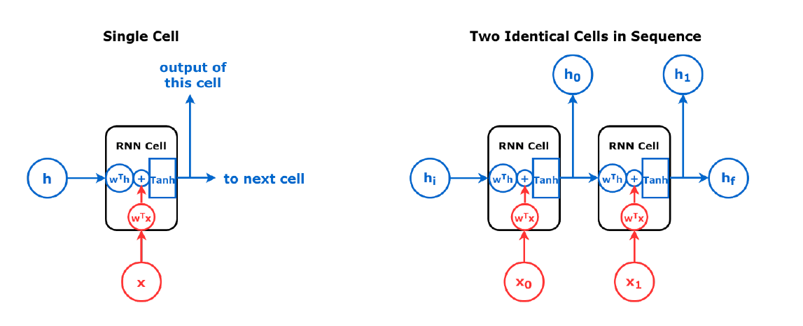
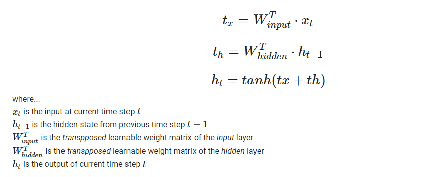
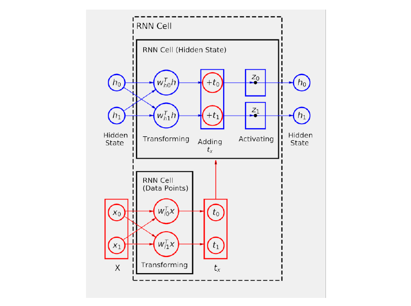
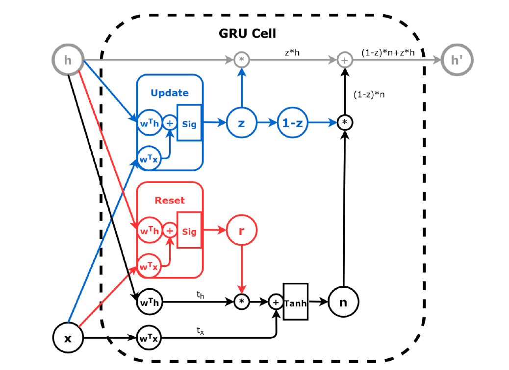
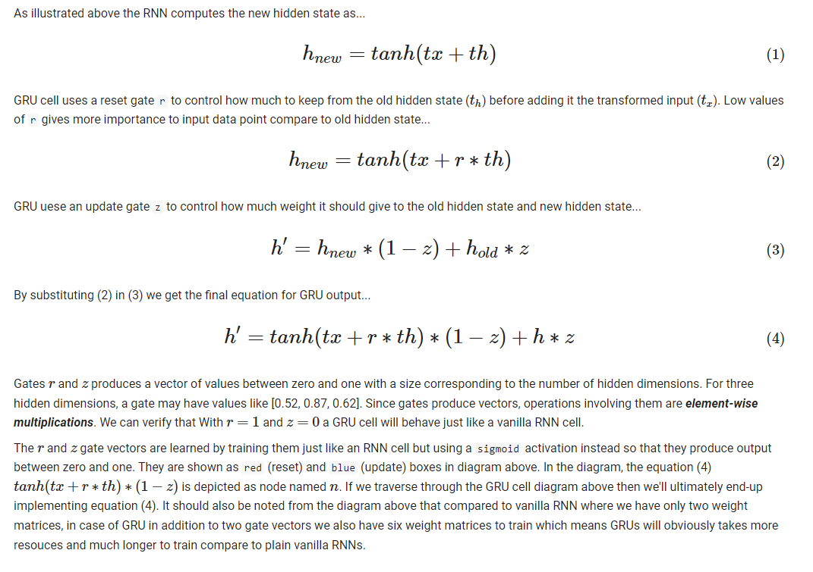
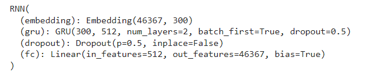
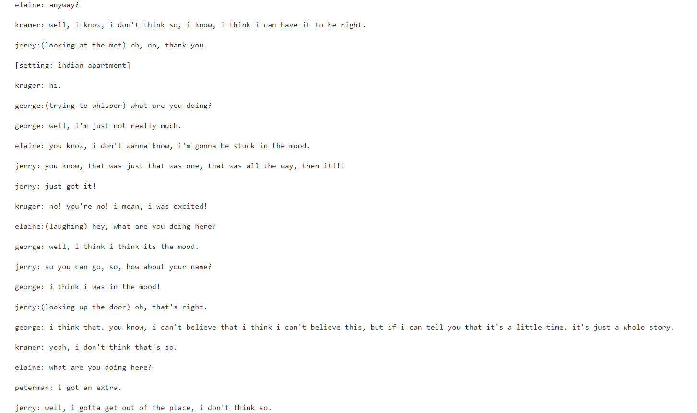

# TV Script Generation using Recurrent Neural Network (RNN)


### Train an RNN based Neural Network to generate fake TV/film script 


## Table of Contents

- [Introduction](#introduction) 
- [Objective](#objective)
- [Dataset](#dataset)
- [Solution Approach](#solution-approach)
- [How To Use](#how-to-use)
- [Credits](#credits)
- [License](#license)
- [Author Info](#author-info)


## Introduction
This project will build and train an RNN based neural network to automatically generate our own [Seinfeld](https://en.wikipedia.org/wiki/Seinfeld) _fake_ TV script. We'll use a small subset of the Seinfeld TV sit-com's script from 9 seasons to train our network. The trained network will then generate a new but _fake_ TV script based on patterns it learned from the training data. RNNs are ideally suited for sequence problems such as these since they take advantage of the underlying structure of the data, namely, the order of the data points.

## Objective
To build an RNN based Neural Network that'd accept a text corpus (TV/film script, book, etc.), learn from it, and then given a seed `prime-word,` it'd generate a _fake_ text snippet that'd look like if this generated text came from the original script/book. 


---
## Dataset
- The dataset used in this project is a subset of the original [Seinfeld dataset](https://www.kaggle.com/thec03u5/seinfeld-chronicles#scripts.csv) on Kaggle.
- The dataset is provided as part of this repo, and it's kept in `data/Seinfeld_Scripts.txt` as a plain text file.

---
## Solution Approach
### Load and Explore Data
- load the Seinfeld TV script `Seinfeld_Scripts.txt` as a text blob
- Once data is loaded, we play around and explore data to view different script parts. This gives us a sense/structure of the data we'll be working with. For example, it is all lowercase text, and a newline character `\ n separates each new line of dialogue`. We could extract information such as...

    **Dataset Stats**<br>
    Roughly the number of unique words: 46367<br>
    Number of lines: 109233<br>
    The average number of words in each line: 5.544240293684143<br>
    The lines 0 to 10:<br>
    >jerry: do you know what this is all about? Do you know, why we are here? To be out, this is out...and out is one of the single most enjoyable experiences of life. people...did you ever hear people talking about we should go out? this is what theyre talking about...this whole thing, were all out now, no one is home. not one person here is home, were all out! there are people trying to find us, they dont know where we are. (on an imaginary phone) did you ring?, i cant find him. where did he go? he didnt tell me where he was going. he must have gone out. you wanna go out you get ready, you pick out the clothes, right? you take the shower, you get all ready, get the cash, get your friends, the car, the spot, the reservation...then youre standing around, what do you do? you go we gotta be getting back. once youre out, you wanna get back! you wanna go to sleep, you wanna get up, you wanna go out again tomorrow, right? where ever you are in life, its my feeling, youve gotta go.<br>
    >jerry: (pointing at georges shirt) see, to me, that button is in the worst possible spot. the second button literally makes or breaks the shirt, look at it. its too high! its in no-mans-land. you look like you live with your mother. <br>
    >george: are you through? <br>
    >jerry: you do of course try on, when you buy? <br>
    >george: yes, it was purple, i liked it, i dont actually recall considering the buttons. 

### Pre-process Data
We'd need to prepare the textual data for modeling, i.e., preprocess data, to be fed to a Neural Network as `numbers.`

- We define a `lookup-table` (dictionary) for `punctuation-symbols` as shown below and then replace each occurrence of punctuation with its corresponding symbol we defined. <br><br>
  ```python
     punct = {'.': '||Period||',
              ',': '||Comma||',
              '"': '||Quotation_Mark||',
              ';': '||Semicolon||',
              '!': '||Exclamation_mark||',
              '?': '||Question_mark||',
              '(': '||Left_Parentheses||',
              ')': '||Right_Parentheses||',
              '-': '||Dash||',
              '\n': '||Return||'    
    }
  ```
- The text corpus is then converted into `lowercase` letters
- We then look through the whole text corpus and generate two mappings...
  1. `vocab_to_int` : This maps each _unique_ `word` in the text to an _unique_ `integer` (value). This map will be used to encode the text into numbers to feed to our network.
  2. `int_to_vocab`: This is the reverse of the above map where each unique `integer` (key) is mapped to a _unique_ `word` (value). This map will convert the model-generated output, which is numbers back to the text to be presented back to the user as text.
- Using the `vocab_to_int` map, we encode our text corpus into a massive list of numbers.
- Since data preprocessing done above can take quite a while to complete, as a final step, we serialize (`pickle`) all three maps created above and encoded text as python objects in the `preprocess.p` file. We do this so that if we need to run our notebook from the start again, we do not need to run preprocessing again; it'd save us a lot of time.

### Prepare Data Batches
The problem at hand mandates our network to learn from sequential input data. Data is sequential if elements appear in a particular order, such as the words of a sentence in a TV/Film script. Our network is then expected to produce another sequential data (a fake TV/Film script) that'd appear to have come from the original sequential data corpus. In other words, our objective is to generate `meaningful` text. Our network will consume a starting word (`prime word`), and then it'd try to predict the next most-likely word based on the prime word provided. It'd then try to predict the next word based on previously predicted words and so on. Unlike a conventional dataset with a well-defined set of `input` features (independent variables) and `target` features (dependent variable) for models to learn from, the textual data does not offer the apparent input and target segregation. Sequential textual data needs to be broken down to produce `input` features (these would be a sequence of words in our case) and `target` feature (the next word that appears next in the given text). The inputs and targets are then paired to create a single data point (data sample), and data points are then batched together to make a training batch of a specified size that can be fed to a neural network.

We have defined a function `batch_data(words, sequence_length, batch_size)` to perform the data batching operation. The function would split the encoded input-text (`words`) into sequences of words; each sequence will have an equal number of words. The first sequence will start from _first-word_ up to `sequence_length` following words in the input text, where each word in the sequence can be considered as _independent-variable_. This sequence will then be paired with _next-word_ in the input text as _dependent-variable_ (target). The paired sequence and its target is a single data point. This process is repeated, but this time sequence starts from `second-word` in the input text and so on. Finally, data points are packed into batches of given batch_size using `TensorDataset` and `DataLoader` objects.

For example, say we have these as input:
```
words = [1, 2, 3, 4, 5, 6, 7]
sequence_length = 4
```

The first sequence would contain the values:
```
[1, 2, 3, 4] # independent-variable (input features)
```
And the corresponding target` should be the following word:
```
5 # dependent-variable (target)
```
Now the second sequence would contain the values (note that it's starting from the second word (i.e., 2) this time):
```
[2, 3, 4, 5]  # independent-variable (input features)
6             # dependent-variable (target)
```

For example lets say we have the encoded input text as numbers from [0...52], a call to `batch_data(test_text, sequence_length=5, batch_size=10)` will produce the 2 batches. The first batch (maximum ten sequences of maximum five words each) is shown below...

```python
# independent-variable (input features)
tensor([[ 0,  1,  2,  3,  4],
        [ 5,  6,  7,  8,  9],
        [10, 11, 12, 13, 14],
        [15, 16, 17, 18, 19],
        [20, 21, 22, 23, 24],
        [25, 26, 27, 28, 29],
        [30, 31, 32, 33, 34],
        [35, 36, 37, 38, 39],
        [40, 41, 42, 43, 44],
        [45, 46, 47, 48, 49]])

# dependent-variable (target)
tensor([ 5, 10, 15, 20, 25, 30, 35, 40, 45, 50])
```

Note that above `target` is the next word after the sequence (5 for the first sequence, 10 for the next sequence, and so on)


Since there are more than 50 words, the second batch will be prepared with leftover words, as shown below...

```python
# independent-variable (input features)
tensor([[21387, 21387,    50,    51,    52]])

# independent-variable (input features)
tensor([0])
```

Couple of important things to note... 
(1) Since there are only three words left and the sequence consumes them, the target is taken as the very first word of the input text (0 in this case)
(2) The first two numbers, `21387`, are the special padding character used to pad the small sequence to make them of equal size (5 in this case)

### Define The Network
Since we deal with sequential data here, we'll use an RNN based neural network best suited for such a task. RNN is well suited for sequential data because the order in which the data element appears in sequences is critical. RNN cell keeps track of the cell state (`hidden` state) of *previous* `time-step` along with input from *current* `time-step` to produce an output (which is again input to the next time-step as the previous hidden state). A typical high-level structure of the RNN cell is shown below...



A crucial point to note here is that even though two cells are shown one after the other in the right-side diagram, it's the same cell shown as _unrolled_ just for clarity. This is because the same cell consumes its own previous `hidden state` of the prior time step and the current time-step input and produces a `hidden state` for the next time step. So, for example, each word in a sentence (sequence) can be considered a time step, and they will be processed one at a time, and the output (the resulting hidden state) is fed to the next time step. In essence, it's a `loop-back` mechanism. This is the behavior of RNN cells that allows them to account for dependency among the input and extract `semantic` meaning out of them.

Mathematically at time step `t,` the hidden output of RNN is computed as follows...



As shown above, the `tanh` (Hyperbolic Tangent) function is used as the _activation_ function here. It's very typical of RNN networks to use `tanh` instead of the `ReLU` activation function used by other types of neural networks. This is done because `ReLU` has no upper bound; however, `tanh` maps the feature space to the interval (-1, 1). This ensures that, at every step of the sequence, the hidden state is always between -1 and 1. Given that we have only one linear layer to transform the hidden state, regardless of which step of the sequence it uses, it is convenient to have its values within a predictable range.

An RNN cell structure at a lower level (neuron level) is shown below...



The number of hidden neurons is the `hyperparameter` of the network, chosen to be 2 in the above diagram (hence two blue neurons in the hidden state section). The number of input neurons is automatically determined to be _exactly_ same as the number of hidden neurons because both transformed input and hidden state need to be added together; hence, their shape must match. But,  the _input_ features (words) _dimension_ could be anything. The input features dimension is another hyperparameter of the network. The above diagram shows a two-dimensional (x0 and x1) vector. In this project, we will use an `Embedding` layer that'd transform each word that we have encoded as _single_ unique number to its multi-dimensional vector representation.

- In practice, the plain vanilla RNN shown above is hardly used nowadays, where equal importance is given to both the previous-hidden-state and the current input. What if the previous-hidden-state contains more information than the new-hidden-state or current-input adds more information than the previous-hidden-state? There is no mechanism in vanilla RNNs to assign weights (how much to keep or ignore) to previous-hidden-state, new-hidden-state, and current-input. The improved variants of RNN such as `LSTM` (Long Short Term Memory) or `GRU` (Gated Recurrent Unit) tackle these issues. In practice, an LSTM or GRU cell is used to build RNN based neural net. In this project, we will use the GRU cell because it is slightly lighter than the LSTM cell and trains a bit faster. If LSTM is used, we can get better results than what we are producing with GRU, but it might take much longer to train. A typical GRU cell structure is shown below...






- We have defined the network as a subclass of the `nn.Module` Pytorch class.
- The network architecture is shown below...



- The very first layer of the network is an `Embedding` layer which takes an input vector of size equal to our vocabulary (number of unique words in our training text corpus) and outputs a vector representation of each of the words in the vocabulary. The size of this vector is yet another `hyperparameter` called `embedding dimension` that we define. We have decided to use `300` as the embedding vector size. Note that the vector representation of words is another weight matrix that the embedding layer learns during the training. So an embedding layer is nothing but a giant lookup table of weights where each row corresponds to a unique word in our vocabulary. We look up this table for a given word and extract an `embedding dimension` long vector representation of the word, which is then fed to the next layer in the network. 
- The next layer is a `GRU` RNN cell that gets word vectors (embedding _dim long) from the embedding layer as input and produces `hidden_dim` long outputs. Here we are using two layers of GRU cell, one stacked on top of the other hence `n_layers` parameter is set to 2.
- We are using a 50% `dropout` for GRU cell and 50% dropout between GRU cell and the final fully-connected layer

#### Feed Forward
The shape of input and output produced by each layer of RNN could sometimes get confusing. Hence, it helps if we look closely at the input shape that goes into a layer and the output shape that comes out of it. Because of some reason (which is beyond my mental ability!) Pytorch RNN cells (RNN, GRU, LSTM) expect data input and produce outputs in shape where `sequence_length` is the first dimension, and  `batch_size` is the second. However, we generally get `batch_size` as the first dimension from Dataloaders. To use `batch_size` as the first dimension with RRN, we need to use the `batch_first = True` parameter; you can see this being used with our GRU cell. The `batch_size` make Pytorch RNN cells handle tensors with batch_size as the first dimension for inputs and outputs, but the hidden-state would still have batch_size as the second dimension. Since we seldom directly deal with hidden-state, it's not a big issue, but it's better to be aware of this Pytorch RNN quirk. 

For our network we have selected below hyperparameters to use...
`batch_size = 64`, `sequence_length = 15`, `embedding_dim = 300`, `hidden_dim = 512`, `n_layers = 2`

RNN cells take two input tensors...
1. The input-sequence with shape `(batch_size, sequence_length, input_dim)` --> (64, 15, 300) (input_dim is the output of embedding_layer i.e. embedding_dim)
2. The hidden-state with shape `(n_layers, batch_size, hidden_dim)` --> (2, 64, 512)

And produces two output tensors...
1. Output states as output (hidden state) for all time steps with shape `(batch_size, sequence_length, hidden_dim)` --> (64, 15, 512)
2. Final hidden-state representation of the full sequence with shape `(n_layers, batch_size, hidden_dim)` --> Note that batch_size as second dim (2, 64, 512) (These would be fed as previous hidden-state step in next cycle)

In the `forward` function of the neural network, we have...
* First, Embedding layer that takes word sequence as input in shape (64, 15, 1) and produces output shape (64, 300)
* Next, the GRU layer takes the output of the Embedding layer in shape (64, 300) as a first input and hidden state (from previous time-step or initial hidden weights if it's a very first time-step) as second input in shape (2, 64, 512). It then produces the `cell-output` in shape (64, 15, 512) and `cell-hidden-state` in shape (2, 64, 512)
* 50% dropout is then applied to GRU cell outputs
* GRU cell output is then flattened to (64 * 15, 512) and fed to the `fully-connected` linear layer
* The output of `fully-connected` layer is re-shaped into (batch_size, sequence_length, self.output_size) --> (64, 15, 512)
* the last time-step output is then extracted for each batch.  
* Above extracted output and the hidden-state from GRU are then returned to the training loop to be used in the next iteration of training.

### Train the Network
We use the `Adam` optimizer with `0.0007` learning rate and `CrossEntropyLoss` as the loss function for the network training. Based on numerous experimentations, the final learning rate and hyperparameters listed above were selected... 
    - At first, kept lr = 0.001 hidden_dim large enough at 256 and embedding dim at 200 with seq_len as 5, but the loss did not seem to decrease. 
    - Keeping all param same increased seq_len slowly and found that seq_len = 15 making it go down but stopped decreasing. 
    - Then increased hidden_dim from 128 to 512 gradually and embedding dim from 100 to 300 and observed that loss started to decrease, but in the end, it fluctuated a lot. 
    - Keeping all other params same tried various learning-rate and found that 0.0007 is making loss go down consistently.
    - Also, experimented with n_layers --> when n_layers = 3 loss starts to increase in a couple of epochs when n_layers = 1 loss does not decrease and saturated quickly

With the above experimentation, we finally settled on the below hyperparameters...

    sequence_length = 15  
    batch_size = 64
    num_epochs = 10
    learning_rate = 0.0007 
    embedding_dim = 300
    hidden_dim = 512
    n_layers = 2

- Trained the model with the above hyperparameters for ten epochs, achieved a loss of ~2.5, and saved/serialized the model as `trained_rnn.pt`

```python
Training for 10 epoch(s)...
Epoch:    1/10    Loss: 5.568603610992431
Epoch:    2/10    Loss: 4.7756297567817185
Epoch:    3/10    Loss: 4.38765674001819
Epoch:    4/10    Loss: 4.071462697695352
Epoch:    5/10    Loss: 3.7681871848932764
Epoch:    6/10    Loss: 3.480992128825932
Epoch:    7/10    Loss: 3.196643516758158
Epoch:    8/10    Loss: 2.948043690559297
Epoch:    9/10    Loss: 2.709813594689795
Epoch:   10/10    Loss: 2.509170540952323
Model Trained and Saved
```

### Test the Network
- Loaded the serialized model and preprocessed data and then generated a _fake_script of 400 words shown below...



We can easily see that the _fake_ generated script snippet came from the original TV script; however, it's far from perfect. Multiple characters say (somewhat) complete sentences. All sentences do not make sense, but it doesn't have to be perfect! It takes quite a while and a lot of experimentation and resources to get good results for such a complex task. We can use smaller vocabulary (and discard uncommon words) or get more data to improve outcomes. Still impressive to see how we can get a very trivial network to mimic a human-generated text up to some degree of accuracy with little effort.

Experiment with different prime-word and different script lengths generates some engaging (and funny) text; give it a try!

---
## How To Use
1. Ensure the below-listed packages are installed
    - `NumPy`
    - `pickle`
    - `torch`
2. Download `tv_script_generation.ipynb` jupyter notebook from this repo
3. To train the models, it's recommended to execute the notebook one cell at a time as some steps might take a while to execute. If a GPU is available (recommended), it'll use it automatically; otherwise, it'll fall back to the CPU. 
4. A fully trained model `trained_rnn.pt` and preprocessed data (`preprocess.p`) trained on a small subset of Seinfeld script can be downloaded from [here](https://drive.google.com/file/d/1mwyAofz77zb7PIoWlGXArMlLpUrWpWDM/view?usp=sharing) and [here](https://drive.google.com/file/d/1al45-FofQCpnW_fK_vD9pmdK8xqVhKxV/view?usp=sharing) respectively.
5. Note that even though we have used Seinfeld script to train and generate the text, you can use any other text corpus (tv/film script, books) to re-train the model and generate the script. You will need to preprocess the data and serialize the data as `preprocess.p` before training the model, though. 
6. Once we have the model and preprocessed data, we can start generating the script. The network needs to start with a single prime word and repeat its predictions until it reaches a set length. We'll be using the `generate` function to do this. It takes a word id to start with, `prime_id,` and generates a set length of text, `predict_len.` Example code for script generation is shown in the below code snippet...


```python
    # Load the pre-processed data saved in preprocess.p 
    _, vocab_to_int, int_to_vocab, token_dict = load_preprocess()
    # Load the trained model
    trained_rnn = load_model('trained_rnn')
    # You can choose a different length
    gen_length = 400 
    # You can set the prime word to _any word_ in our dictionary, but it's best to start with a name for generating a TV script.
    prime_word = 'elaine'
    # Generate script and print
    pad_word = SPECIAL_WORDS['PADDING']
    generated_script = generate(trained_rnn, vocab_to_int[prime_word + ':'], int_to_vocab, token_dict, vocab_to_int[pad_word], gen_length)
    print(generated_script)
```


---
## Credits
- Dataset used in this project is provided by [Udacity](https://www.udacity.com/)
- Above dataset is a subset taken from Kaggle, [Seinfeld dataset](https://www.kaggle.com/thec03u5/seinfeld-chronicles#scripts.csv)
- GRU, RNN diagrams courtesy [Daniel V. Godoy](https://github.com/dvgodoy)

---
## License

MIT License

Copyright (c) [2021] [Sunil S. Singh]

Permission is hereby granted, free of charge, to any person obtaining a copy
of this software and associated documentation files (the "Software"), to deal
in the software without restriction, including without limitation the rights
to use, copy, modify, merge, publish, distribute, sublicense, and/or sell
copies of the software, and to permit persons to whom the software is
furnished to do so, subject to the following conditions:

The above copyright notice and this permission notice shall be included in all
copies or substantial portions of the software.

THE SOFTWARE IS PROVIDED "AS IS", WITHOUT WARRANTY OF ANY KIND, EXPRESS OR
IMPLIED, INCLUDING BUT NOT LIMITED TO THE WARRANTIES OF MERCHANTABILITY,
FITNESS FOR A PARTICULAR PURPOSE AND NON-INFRINGEMENT. IN NO EVENT SHALL THE
AUTHORS OR COPYRIGHT HOLDERS BE LIABLE FOR ANY CLAIM, DAMAGES OR OTHER
LIABILITY, WHETHER IN AN ACTION OF CONTRACT, TORT OR OTHERWISE, ARISING FROM,
OUT OF OR IN CONNECTION WITH THE SOFTWARE OR THE USE OR OTHER DEALINGS IN THE
SOFTWARE.

---

## Author Info

- Twitter - [@_sssingh](https://twitter.com/_sssingh)
- Linkedin - [Sunil S. Singh](https://linkedin.com/in/sssingh)


---
